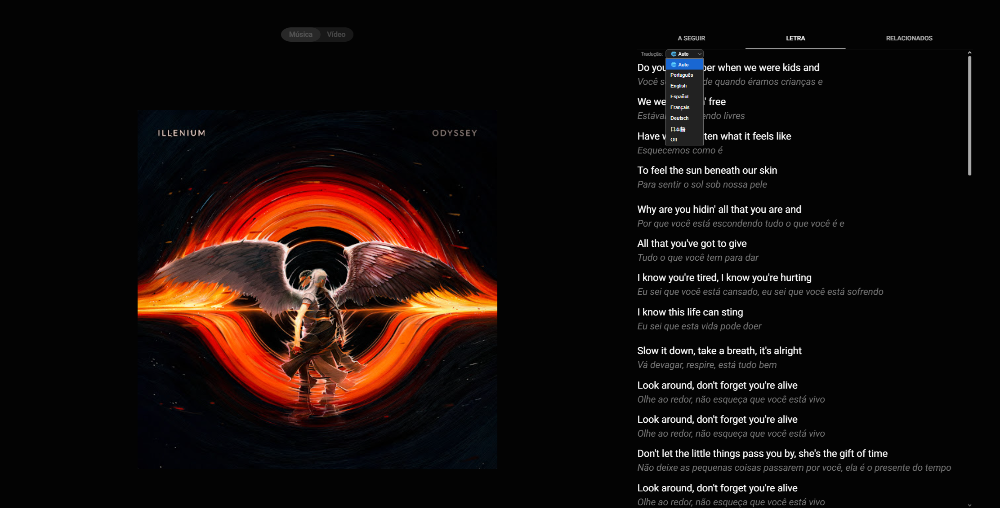
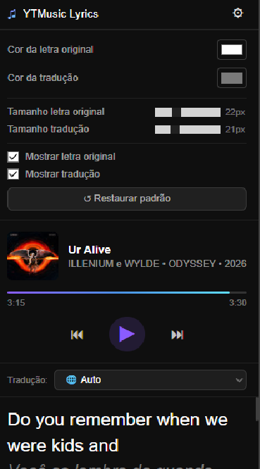

# YTMusic Lyrics Translator

A browser extension for **Opera, Chrome, Edge and Brave** that displays YouTube Music lyrics with real-time translation — line by line, original on top and translation below.


## 📸 Screenshots

| In YouTube Music | Extension Popup |
|:---:|:---:|
|  |  |

## ✨ Features

- Automatic lyrics translation directly in the YouTube Music lyrics panel
- Supports 6 languages: Portuguese, English, Spanish, French, German, Japanese
- Popup mini player: album art, title, artist, progress bar, play/pause/prev/next controls
- Customizable colors for original and translated lyrics
- Works from any browser tab via the extension popup

## 📦 Installation (unpacked)

1. Download or clone this repository
2. Install dependencies and build:
   ```bash
   npm install
   npm run build
   ```
3. Open your browser's extensions page:
   - Opera: `opera://extensions`
   - Chrome: `chrome://extensions`
   - Edge: `edge://extensions`
4. Enable **Developer mode**
5. Click **Load unpacked** and select the `dist/` folder

## 🛠️ Development

```bash
npm install     # install dependencies
npm run build   # compile to dist/
```

Key files:
- `src/content.ts` — translation logic and DOM injection
- `src/popup.ts` — popup player and settings logic
- `public/popup.html` — popup UI

## 🌐 Supported Languages

| Code | Language   |
|------|------------|
| pt   | Português  |
| en   | English    |
| es   | Español    |
| fr   | Français   |
| de   | Deutsch    |
| ja   | 日本語      |

## 📄 License

MIT
